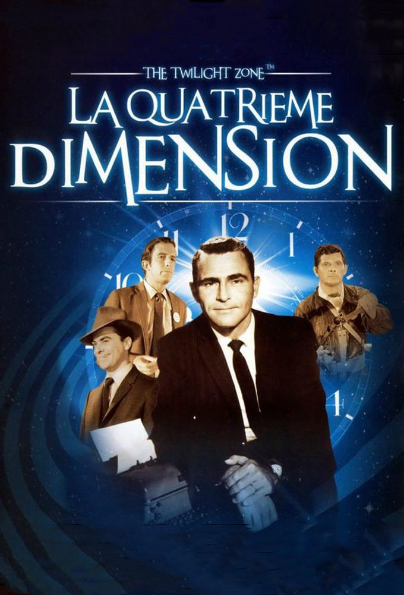
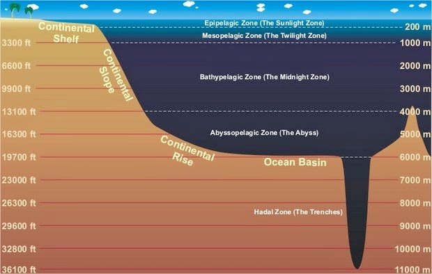

> You unlock this door with the key of imagination. Beyond it is another dimension: a dimension of sound, a dimension of sight, a dimension of mind. You're moving into a land of both shadow and substance, of things and ideas; you've just crossed over into the Twilight Zone.

 

> The mesopelagic zone extends from 200 to 1,000 meters (660-3,300 feet) below the surface of the ocean. This area is known as the twilight zone.

>  The light that reaches the mesopelagic zone is dim and does not allow for photosynthesis but there are a number of marine animals that live in. These animals include fish, shrimp, squid, snipe eels, jellyfish, and zooplankton.

   

> Some could have 4 git branches and D shaped head.

---
## 📦 Components
---

### Language

|Name|Description|Language|License|
|-|-|-|-|
| [Null Coaliescing][NullCoaliescing-url] | [Null Coaliescing](https://en.wikipedia.org/wiki/Null_coalescing_operator) | [![language][NullCoaliescing-top]][NullCoaliescing-url] | ![language][NullCoaliescing-license-shield] |
| [Formula Compose][formula_compose-url] | Compose formula | [![language][formula_compose-top]][formula_compose-url] | ![language][formula_compose-license-shield] |
| [Iterable][Iterable-url] | Iterate over many things| [![language][Iterable-top]][Iterable-url] | ![language][Iterable-license-shield] |
| [Collection Utils][CollectionUtils-url] | Some methods for collection | [![language][CollectionUtils-top]][CollectionUtils-url] | ![language][CollectionUtils-license-shield] |
| [Classy][Classy-url] | Use Class instead of 4D Method | [![language][Classy-top]][Classy-url] | ![language][Classy-license-shield] |

### Data

|Name|Description|Language|License|
|-|-|-|-|
| [Shoal][Shoal-url] | Group data by field to analysis or render graphic | [![language][Shoal-top]][Shoal-url] | ![language][Shoal-license-shield] |

### IDE

|Name|Description|Language|License|
|-|-|-|-|
| [ClassStoreDiagram][ClassStoreDiagram-url] | Convert `cs` to diagram | [![language][ClassStoreDiagram-top]][ClassStoreDiagram-url] | ![language][ClassStoreDiagram-license-shield] |

### API

|Name|Description|Language|License|
|-|-|-|-|
| [Discord.4d][Discord.4d-url] | Send message to [Discord](https://discord.com/) | [![language][Discord.4d-top]][Discord.4d-url] | ![language][Discord.4d-license-shield] |
| [Twilio][Twilio-url] | Send SMS using [Twilio](https://www.twilio.com/) | [![language][Twilio-top]][Twilio-url] | ![language][Twilio-license-shield] |

### Security

|Name|Description|Language|License|
|-|-|-|-|
| [OTP][OTP-url] | [One time password](https://en.wikipedia.org/wiki/One-time_password) | [![language][OTP-top]][OTP-url] | ![language][OTP-license-shield] |

### Test/QA

|Name|Description|Language|License|
|-|-|-|-|
| [expect][expect-url] | Matchers for BDD test | [![language][expect-top]][expect-url] | ![language][expect-license-shield] |

### Web

|Name|Description|Language|License|
|-|-|-|-|
| [Tricho][Tricho-url] | Web rooter, utility methods | [![language][Tricho-top]][Tricho-url] | ![language][Tricho-license-shield] |

### Web component

|Name|Description|Language|License|
|-|-|-|-|
| [Mark4Down][Mark4Down-url] | Web markdown editor on current base| [![language][Mark4Down-top]][Mark4Down-url] | ![language][Mark4Down-license-shield] |
| [JSONToCode][JSONToCode-url] | JSON to 4D code| [![language][JSONToCode-top]][JSONToCode-url] | ![language][JSONToCode-license-shield] |
| [Mesopotamia][Mesopotamia-url] | Convert Javascript to 4D Code | [![language][Mesopotamia-top]][Mesopotamia-url] | ![language][Mesopotamia-license-shield] |

### Form macros

|Name|Description|Language|License|
|-|-|-|-|
| [SelectPictureFormMacro][SelectPictureFormMacro-url] | Select picture from current from, `/RESOURCES` or disk | [![language][SelectPictureFormMacro-top]][SelectPictureFormMacro-url] | ![language][SelectPictureFormMacro-license-shield] |
| [ExtractToSubformFormMacro][ExtractToSubformFormMacro-url] | Copy objects from subform or create new subform from objects | [![language][ExtractToSubformFormMacro-top]][ExtractToSubformFormMacro-url] | ![language][ExtractToSubformFormMacro-license-shield] |
| [FormObject][FormObject-url] | Select existing css class, generate css or 4d code| [![language][FormObject-top]][FormObject-url] | ![language][FormObject-license-shield] |
| [TransmuteFormMacro][TransmuteFormMacro-url] | Transmute an object to another type| [![language][TransmuteFormMacro-top]][TransmuteFormMacro-url] | ![language][TransmuteFormMacro-license-shield] |
| [StackView][StackView-url] | layout inspired from iOS stackView| [![language][StackView-top]][StackView-url] | ![language][StackView-license-shield] |

---
## 🚧 Work in progress
---

|Name|Description|Language|License|
|-|-|-|-|
| [ObjectClassMapper][ObjectClassMapper-url] | Map JSON/Object to structure | [![language][ObjectClassMapper-top]][ObjectClassMapper-url] | ![language][ObjectClassMapper-license-shield] |
| [Kaluza][Kaluza-url] | Package manager for 4d | [![language][Kaluza-top]][Kaluza-url] | ![language][Kaluza-license-shield] |
| [Kaluza-cli][Kaluza-cli-url] | CLI for Kaluza | [![language][Kaluza-cli-top]][Kaluza-cli-url] | ![language][Kaluza-cli-license-shield] |

---

## Any question about this unknown dimension?

[![discord][discord-shield]][discord-url] 

## To help the dimension growth

If you like my content, please consider buying me a coffee. 

or if you run a business and you're using one of my other projects in a revenue-generating product, it makes business sense to sponsor this development

Thank you for your support! 

---

[discord-shield]: https://img.shields.io/badge/chat-discord-7289DA?logo=discord&style=flat
[discord-url]: https://discord.gg/dVTqZHr
[NullCoaliescing-top]: https://img.shields.io/github/languages/top/mesopelagique/NullCoaliescing.svg
[NullCoaliescing-url]: NullCoaliescing
[NullCoaliescing-license-shield]: https://img.shields.io/github/license/mesopelagique/NullCoaliescing
[formula_compose-top]: https://img.shields.io/github/languages/top/mesopelagique/formula_compose.svg
[formula_compose-url]: formula_compose
[formula_compose-license-shield]: https://img.shields.io/github/license/mesopelagique/formula_compose
[CollectionUtils-top]: https://img.shields.io/github/languages/top/mesopelagique/CollectionUtils.svg
[CollectionUtils-url]: CollectionUtils
[CollectionUtils-license-shield]: https://img.shields.io/github/license/mesopelagique/CollectionUtils
[ObjectClassMapper-top]: https://img.shields.io/github/languages/top/mesopelagique/ObjectClassMapper.svg
[ObjectClassMapper-url]: ObjectClassMapper
[ObjectClassMapper-license-shield]: https://img.shields.io/github/license/mesopelagique/ObjectClassMapper
[Kaluza-top]: https://img.shields.io/github/languages/top/mesopelagique/Kaluza.svg
[Kaluza-url]: Kaluza
[Kaluza-license-shield]: https://img.shields.io/github/license/mesopelagique/kaluza
[Kaluza-cli-top]: https://img.shields.io/github/languages/top/mesopelagique/kaluza-cli.svg
[Kaluza-cli-url]: kaluza-cli
[Kaluza-cli-license-shield]: https://img.shields.io/github/license/mesopelagique/kaluza-cli
[Iterable-top]: https://img.shields.io/github/languages/top/mesopelagique/Iterable.svg
[Iterable-url]: Iterable
[Iterable-license-shield]: https://img.shields.io/github/license/mesopelagique/Iterable
[Discord.4d-top]: https://img.shields.io/github/languages/top/mesopelagique/Discord.4d.svg
[Discord.4d-url]: Discord.4d
[Discord.4d-license-shield]: https://img.shields.io/github/license/mesopelagique/Discord.4d
[Twilio-top]: https://img.shields.io/github/languages/top/mesopelagique/Twilio.svg
[Twilio-url]: Twilio
[Twilio-license-shield]: https://img.shields.io/github/license/mesopelagique/Twilio
[expect-top]: https://img.shields.io/github/languages/top/mesopelagique/expect.svg
[expect-url]: expect
[expect-license-shield]: https://img.shields.io/github/license/mesopelagique/expect
[ClassStoreDiagram-top]: https://img.shields.io/github/languages/top/mesopelagique/ClassStoreDiagram.svg
[ClassStoreDiagram-url]: ClassStoreDiagram
[ClassStoreDiagram-license-shield]: https://img.shields.io/github/license/mesopelagique/ClassStoreDiagram
[Mark4Down-top]: https://img.shields.io/github/languages/top/mesopelagique/Mark4Down.svg
[Mark4Down-url]: Mark4Down
[Mark4Down-license-shield]: https://img.shields.io/github/license/mesopelagique/Mark4Down
[JSONToCode-top]: https://img.shields.io/github/languages/top/mesopelagique/JSONToCode.svg
[JSONToCode-url]: JSONToCode
[JSONToCode-license-shield]: https://img.shields.io/github/license/mesopelagique/JSONToCode
[Classy-top]: https://img.shields.io/github/languages/top/mesopelagique/Classy.svg
[Classy-url]: Classy
[Classy-license-shield]: https://img.shields.io/github/license/mesopelagique/Classy
[Mesopotamia-top]: https://img.shields.io/github/languages/top/mesopelagique/Mesopotamia.svg
[Mesopotamia-url]: Mesopotamia
[Mesopotamia-license-shield]: https://img.shields.io/github/license/mesopelagique/Mesopotamia
[Tricho-top]: https://img.shields.io/github/languages/top/mesopelagique/Tricho.svg
[Tricho-url]: Tricho
[Tricho-license-shield]: https://img.shields.io/github/license/mesopelagique/Tricho
[Shoal-top]: https://img.shields.io/github/languages/top/mesopelagique/Shoal.svg
[Shoal-url]: Shoal
[Shoal-license-shield]: https://img.shields.io/github/license/mesopelagique/Shoal
[OTP-top]: https://img.shields.io/github/languages/top/mesopelagique/OTP.svg
[OTP-url]: OTP
[OTP-license-shield]: https://img.shields.io/github/license/mesopelagique/OTP
[SelectPictureFormMacro-top]: https://img.shields.io/github/languages/top/mesopelagique/SelectPictureFormMacro.svg
[SelectPictureFormMacro-url]: SelectPictureFormMacro
[SelectPictureFormMacro-license-shield]: https://img.shields.io/github/license/mesopelagique/SelectPictureFormMacro
[ExtractToSubformFormMacro-top]: https://img.shields.io/github/languages/top/mesopelagique/ExtractToSubformFormMacro.svg
[ExtractToSubformFormMacro-url]: ExtractToSubformFormMacro
[ExtractToSubformFormMacro-license-shield]: https://img.shields.io/github/license/mesopelagique/ExtractToSubformFormMacro
[FormObject-top]: https://img.shields.io/github/languages/top/mesopelagique/FormObject.svg
[FormObject-url]: FormObject
[FormObject-license-shield]: https://img.shields.io/github/license/mesopelagique/FormObject
[TransmuteFormMacro-top]: https://img.shields.io/github/languages/top/mesopelagique/TransmuteFormMacro.svg
[TransmuteFormMacro-url]: TransmuteFormMacro
[TransmuteFormMacro-license-shield]: https://img.shields.io/github/license/mesopelagique/TransmuteFormMacro
[StackView-top]: https://img.shields.io/github/languages/top/mesopelagique/StackView.svg
[StackView-url]: StackView
[StackView-license-shield]: https://img.shields.io/github/license/mesopelagique/StackView
