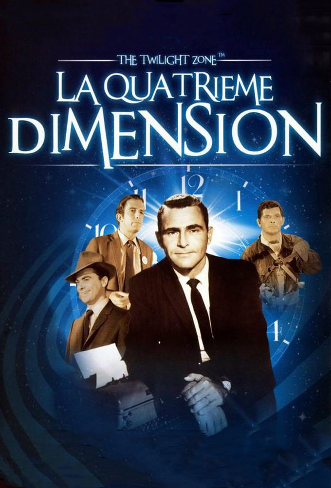
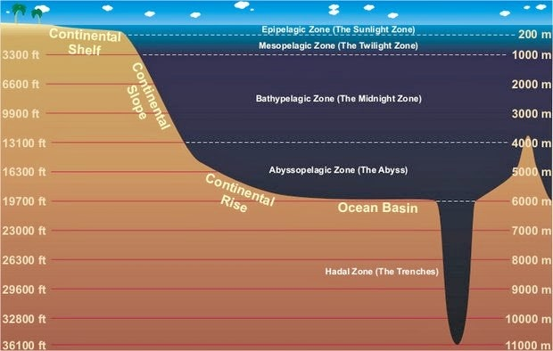
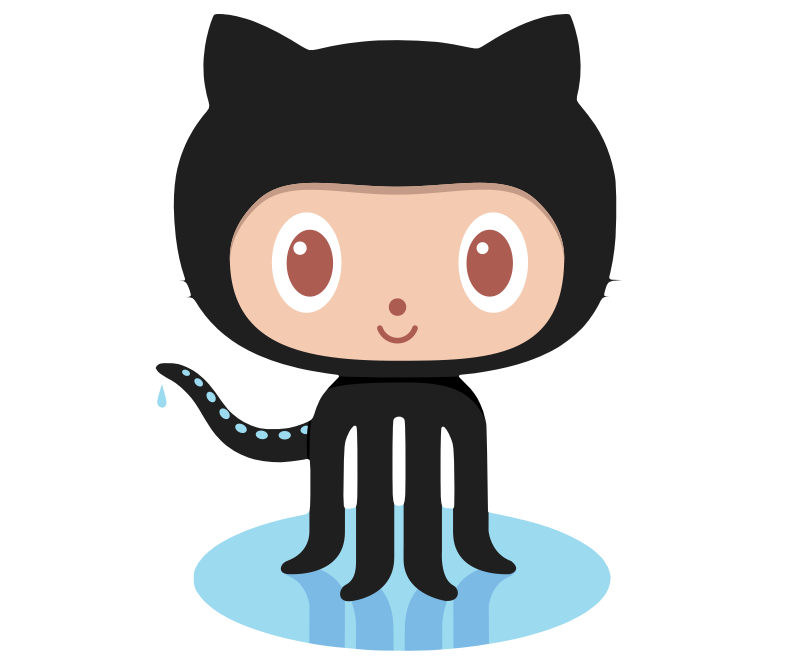
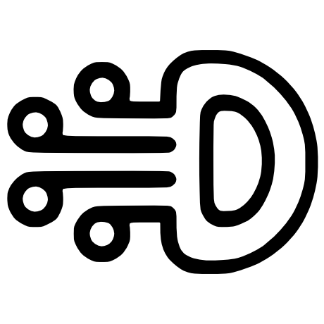

📖 [**Blog**](/blog/) — announcements of new components · ✍️ [**AI / Swift / some 4D notes**](https://phimage.github.io/)

---

> You unlock this door with the key of imagination. Beyond it is another dimension: a dimension of sound, a dimension of sight, a dimension of mind. You're moving into a land of both shadow and substance, of things and ideas; you've just crossed over into the Twilight Zone.

 

> The mesopelagic zone extends from 200 to 1,000 meters (660-3,300 feet) below the surface of the ocean. This area is known as the twilight zone.

>  The light that reaches the mesopelagic zone is dim and does not allow for photosynthesis but there are a number of marine animals that live in. These animals include fish, shrimp, squid, snipe eels, jellyfish, and zooplankton.

   

> Some could have 4 git branches and D shaped head.

---
## 📦 Components
---

> 🧩 next to a **Release** means that release ships a packaged `.zip` asset, so the component is installable with the [4D dependency manager](https://developer.4d.com/docs/Project/components). A version **without** 🧩 has a release but no installable archive yet; **no releases** means source-only / work in progress.

### 🔤 Language

|Name|Description|Language|Release|License|
|-|-|-|-|-|
| [Null Coalescing][NullCoaliescing-url] | [Null coalescing](https://en.wikipedia.org/wiki/Null_coalescing_operator) operator for 4D · 💤 *archived* | [![language][NullCoaliescing-top]][NullCoaliescing-url] | [![release][NullCoaliescing-release]][NullCoaliescing-url] | ![license][NullCoaliescing-license-shield] |
| [Formula Compose][formula_compose-url] | Compose / chain formula executions | [![language][formula_compose-top]][formula_compose-url] | [![release][formula_compose-release]][formula_compose-url] | ![license][formula_compose-license-shield] |
| [Iterable][Iterable-url] | Iterate over objects, collections and custom types | [![language][Iterable-top]][Iterable-url] | [![release][Iterable-release]][Iterable-url] | ![license][Iterable-license-shield] |
| [Collection Utils][CollectionUtils-url] | Extra methods for collections | [![language][CollectionUtils-top]][CollectionUtils-url] | [![release][CollectionUtils-release]][CollectionUtils-url] | ![license][CollectionUtils-license-shield] |
| [Classy][Classy-url] | Use a Class instead of a 4D method | [![language][Classy-top]][Classy-url] | [![release][Classy-release]][Classy-url] | ![license][Classy-license-shield] |
| [SemVer][SemVer-url] | [Semantic Versioning](https://semver.org/) for 4D | [![language][SemVer-top]][SemVer-url] | [![release][SemVer-release]][SemVer-url] 🧩 | ![license][SemVer-license-shield] |
| [State][State-url] | Finite state machines for 4D | [![language][State-top]][State-url] | [![release][State-release]][State-url] 🧩 | ![license][State-license-shield] |
| [Expression Language][ExpressionLanguage-url] | An expression language for 4D | [![language][ExpressionLanguage-top]][ExpressionLanguage-url] | [![release][ExpressionLanguage-release]][ExpressionLanguage-url] 🧩 | ![license][ExpressionLanguage-license-shield] |
| [Maybe Monad][MaybeMonad-url] | Maybe monad instead of `nil`-checks | [![language][MaybeMonad-top]][MaybeMonad-url] | [![release][MaybeMonad-release]][MaybeMonad-url] | ![license][MaybeMonad-license-shield] |
| [Argument Parser][ArgumentParser-url] | Parse command-line style arguments | [![language][ArgumentParser-top]][ArgumentParser-url] | [![release][ArgumentParser-release]][ArgumentParser-url] | ![license][ArgumentParser-license-shield] |
| [Get/Set Wrappers][GetSetWrappers-url] | Getters and setters helpers | [![language][GetSetWrappers-top]][GetSetWrappers-url] | [![release][GetSetWrappers-release]][GetSetWrappers-url] | ![license][GetSetWrappers-license-shield] |

### ✨ AI / LLM

|Name|Description|Language|Release|License|
|-|-|-|-|-|
| [AIKit Agent Tools][AIKitAgentTools-url] | Ready-to-use AI tools for [4D AIKit](https://github.com/4d/4D-AIKit) (tool / function calling) | [![language][AIKitAgentTools-top]][AIKitAgentTools-url] | [![release][AIKitAgentTools-release]][AIKitAgentTools-url] 🧩 | ![license][AIKitAgentTools-license-shield] |
| [MCP][MCP-url] | [Model Context Protocol](https://modelcontextprotocol.io/) client for 4D | [![language][MCP-top]][MCP-url] | [![release][MCP-release]][MCP-url] 🧩 | ![license][MCP-license-shield] |
| [PromptKit][PromptKit-url] | Run reusable prompts and chain AI workflows | [![language][PromptKit-top]][PromptKit-url] | [![release][PromptKit-release]][PromptKit-url] 🧩 | ![license][PromptKit-license-shield] |
| [CopilotSDK][CopilotSDK-url] | 4D port of the GitHub Copilot SDK | [![language][CopilotSDK-top]][CopilotSDK-url] | [![release][CopilotSDK-release]][CopilotSDK-url] 🧩 | ![license][CopilotSDK-license-shield] |
| [CopilotSDK → OpenAI][CopilotSDKToOpenAI-url] | OpenAI-compatible web server for CopilotSDK | [![language][CopilotSDKToOpenAI-top]][CopilotSDKToOpenAI-url] | [![release][CopilotSDKToOpenAI-release]][CopilotSDKToOpenAI-url] 🧩 | ![license][CopilotSDKToOpenAI-license-shield] |
| [TextChunker4D][TextChunker4D-url] | Split text into stable chunks for embeddings / RAG | [![language][TextChunker4D-top]][TextChunker4D-url] | [![release][TextChunker4D-release]][TextChunker4D-url] 🧩| ![license][TextChunker4D-license-shield] |
| [Beyond Pelagic Encoding][BeyondPelagicEncoding-url] | Token estimation & tokenization before embedding / chat APIs | [![language][BeyondPelagicEncoding-top]][BeyondPelagicEncoding-url] | [![release][BeyondPelagicEncoding-release]][BeyondPelagicEncoding-url] 🧩 | ![license][BeyondPelagicEncoding-license-shield] |
| [AI Provider Info][AIProviderInfo-url] | Info about AI providers and models | [![language][AIProviderInfo-top]][AIProviderInfo-url] | [![release][AIProviderInfo-release]][AIProviderInfo-url] | ![license][AIProviderInfo-license-shield] |
| [Codex][Codex-url] | Wraps `codex app-server` in 4D | [![language][Codex-top]][Codex-url] | [![release][Codex-release]][Codex-url] | ![license][Codex-license-shield] |

### 🗄️ Data

|Name|Description|Language|Release|License|
|-|-|-|-|-|
| [Shoal][Shoal-url] | Group data by field to analyse or render graphics | [![language][Shoal-top]][Shoal-url] | [![release][Shoal-release]][Shoal-url] | ![license][Shoal-license-shield] |
| [Object Class Mapper][ObjectClassMapper-url] | Map JSON / Object to a class structure | [![language][ObjectClassMapper-top]][ObjectClassMapper-url] | [![release][ObjectClassMapper-release]][ObjectClassMapper-url] | ![license][ObjectClassMapper-license-shield] |
| [BSON][BSON-url] | [Binary JSON](https://bsonspec.org/) (BSON) for 4D | [![language][BSON-top]][BSON-url] | [![release][BSON-release]][BSON-url] 🧩 | ![license][BSON-license-shield] |
| [PeD4ntic][PeD4ntic-url] | JSON Schema utilities | [![language][PeD4ntic-top]][PeD4ntic-url] | [![release][PeD4ntic-release]][PeD4ntic-url] 🧩 | ![license][PeD4ntic-license-shield] |
| [JSON Rules Engine][JSONRulesEngine-url] | A JSON rules engine | [![language][JSONRulesEngine-top]][JSONRulesEngine-url] | [![release][JSONRulesEngine-release]][JSONRulesEngine-url] 🧩 | ![license][JSONRulesEngine-license-shield] |
| [Mystax][Mystax-url] | [Mustache](https://mustache.github.io/) templating in 4D | [![language][Mystax-top]][Mystax-url] | [![release][Mystax-release]][Mystax-url] 🧩 | ![license][Mystax-license-shield] |
| [Lottie][Lottie-url] | Parse and serialize [Lottie](https://lottiefiles.com/) animation files | [![language][Lottie-top]][Lottie-url] | [![release][Lottie-release]][Lottie-url] 🧩 | ![license][Lottie-license-shield] |

### 🛠️ IDE

|Name|Description|Language|Release|License|
|-|-|-|-|-|
| [ClassStoreDiagram][ClassStoreDiagram-url] | Generate a diagram from your `cs` class store | [![language][ClassStoreDiagram-top]][ClassStoreDiagram-url] | [![release][ClassStoreDiagram-release]][ClassStoreDiagram-url] 🧩 | ![license][ClassStoreDiagram-license-shield] |
| [GenerateHTTPHandlersJSON][GenerateHTTPHandlersJSON-url] | Generate `HTTPHandlers.json` from `// @VERB(pattern)` route comments | [![language][GenerateHTTPHandlersJSON-top]][GenerateHTTPHandlersJSON-url] | [![release][GenerateHTTPHandlersJSON-release]][GenerateHTTPHandlersJSON-url] 🧩 | ![license][GenerateHTTPHandlersJSON-license-shield] |
| [Blame4D][Blame4D-url] | Graphical `git blame` for your code | [![language][Blame4D-top]][Blame4D-url] | [![release][Blame4D-release]][Blame4D-url] | ![license][Blame4D-license-shield] |
| [OpenIn][OpenIn-url] | macOS macro to open current project / method in other apps | [![language][OpenIn-top]][OpenIn-url] | [![release][OpenIn-release]][OpenIn-url] 🧩 | ![license][OpenIn-license-shield] |
| [VS Theme Converter][VSThemeConverter-url] | Convert a VS Code theme to a 4D theme | [![language][VSThemeConverter-top]][VSThemeConverter-url] | [![release][VSThemeConverter-release]][VSThemeConverter-url] 🧩 | ![license][VSThemeConverter-license-shield] |
| [Deploy Component][DeployComponent-url] | Macro to deploy a 4D component to an app or folder | [![language][DeployComponent-top]][DeployComponent-url] | [![release][DeployComponent-release]][DeployComponent-url] | ![license][DeployComponent-license-shield] |
| [Indexator][Indexator-url] | Move `.4dm` files according to `folders.json` | [![language][Indexator-top]][Indexator-url] | [![release][Indexator-release]][Indexator-url] | ![license][Indexator-license-shield] |
| [Macross][Macross-url] | Utilities to edit or create macros | [![language][Macross-top]][Macross-url] | [![release][Macross-release]][Macross-url] | ![license][Macross-license-shield] |
| [Emoji Macro][EmojiMacro-url] | Emoji macro file | [![language][EmojiMacro-top]][EmojiMacro-url] | [![release][EmojiMacro-release]][EmojiMacro-url] | ![license][EmojiMacro-license-shield] |

### 🔌 API

|Name|Description|Language|Release|License|
|-|-|-|-|-|
| [Discord.4d][Discord.4d-url] | Send messages to [Discord](https://discord.com/) | [![language][Discord.4d-top]][Discord.4d-url] | [![release][Discord.4d-release]][Discord.4d-url] | ![license][Discord.4d-license-shield] |
| [Twilio][Twilio-url] | Send SMS using [Twilio](https://www.twilio.com/) | [![language][Twilio-top]][Twilio-url] | [![release][Twilio-release]][Twilio-url] | ![license][Twilio-license-shield] |
| [JSON-RPC][JSONRPC-url] | [JSON-RPC 2.0](https://www.jsonrpc.org/) implementation | [![language][JSONRPC-top]][JSONRPC-url] | [![release][JSONRPC-release]][JSONRPC-url] 🧩 | ![license][JSONRPC-license-shield] |
| [Github.4d][Gihub.4d-url] | Connect to the GitHub API | [![language][Gihub.4d-top]][Gihub.4d-url] | [![release][Gihub.4d-release]][Gihub.4d-url] | ![license][Gihub.4d-license-shield] |
| [OVH][OVH-url] | [OVH](https://www.ovh.com/) API client (WIP) | [![language][OVH-top]][OVH-url] | [![release][OVH-release]][OVH-url] 🧩 | ![license][OVH-license-shield] |
| [PIM][PIM-url] | vCard / vCalendar builder classes | [![language][PIM-top]][PIM-url] | [![release][PIM-release]][PIM-url] | ![license][PIM-license-shield] |
| [HTTP Request Builder][HTTPRequestBuilder-url] | Build HTTP requests with a builder pattern | [![language][HTTPRequestBuilder-top]][HTTPRequestBuilder-url] | [![release][HTTPRequestBuilder-release]][HTTPRequestBuilder-url] | ![license][HTTPRequestBuilder-license-shield] |

### 🔐 Security

|Name|Description|Language|Release|License|
|-|-|-|-|-|
| [OTP][OTP-url] | [One-time password](https://en.wikipedia.org/wiki/One-time_password): OTP, HOTP, TOTP | [![language][OTP-top]][OTP-url] | [![release][OTP-release]][OTP-url] | ![license][OTP-license-shield] |

### 🧪 Test / QA

|Name|Description|Language|Release|License|
|-|-|-|-|-|
| [expect][expect-url] | Matchers for BDD-style tests | [![language][expect-top]][expect-url] | [![release][expect-release]][expect-url] | ![license][expect-license-shield] |

### 🌐 Web

|Name|Description|Language|Release|License|
|-|-|-|-|-|
| [Tricho][Tricho-url] | Web router and utility methods | [![language][Tricho-top]][Tricho-url] | [![release][Tricho-release]][Tricho-url] | ![license][Tricho-license-shield] |

### 🕸️ Web component

|Name|Description|Language|Release|License|
|-|-|-|-|-|
| [Mark4Down][Mark4Down-url] | Realtime markdown editor on your 4D database | [![language][Mark4Down-top]][Mark4Down-url] | [![release][Mark4Down-release]][Mark4Down-url] 🧩 | ![license][Mark4Down-license-shield] |
| [JSONToCode][JSONToCode-url] | Turn JSON into 4D code | [![language][JSONToCode-top]][JSONToCode-url] | [![release][JSONToCode-release]][JSONToCode-url] | ![license][JSONToCode-license-shield] |
| [Mesopotamia][Mesopotamia-url] | Convert JavaScript to 4D code | [![language][Mesopotamia-top]][Mesopotamia-url] | [![release][Mesopotamia-release]][Mesopotamia-url] | ![license][Mesopotamia-license-shield] |
| [Xterm4D][Xterm4D-url] | Terminal output in a Web Area via [xterm.js](https://xtermjs.org/) | [![language][Xterm4D-top]][Xterm4D-url] | [![release][Xterm4D-release]][Xterm4D-url] 🧩 | ![license][Xterm4D-license-shield] |
| [Ansi][Ansi-url] | ANSI / terminal toolkit: colored output, parsing, dashboards | [![language][Ansi-top]][Ansi-url] | [![release][Ansi-release]][Ansi-url] 🧩 | ![license][Ansi-license-shield] |

### 🖌️ UI

|Name|Description|Language|Release|License|
|-|-|-|-|-|
| [Hero][Hero-url] | Shared element transitions for forms — hero / magic-move animations (`cs.hero`) | [![language][Hero-top]][Hero-url] | [![release][Hero-release]][Hero-url] | ![license][Hero-license-shield] |
| [ActivityIndicator][ActivityIndicator-url] | Eight spinners built on `cs.hero`, ported from [IBAnimatable](https://github.com/IBAnimatable/IBAnimatable) — each one a loop of tweens | [![language][ActivityIndicator-top]][ActivityIndicator-url] | [![release][ActivityIndicator-release]][ActivityIndicator-url] | ![license][ActivityIndicator-license-shield] |
| [EscapingButton][EscapingButton-url] | The OK button that will not be clicked. Each escape is one easing curve in a costume | [![language][EscapingButton-top]][EscapingButton-url] | [![release][EscapingButton-release]][EscapingButton-url] | ![license][EscapingButton-license-shield] |
| [MatrixRain][MatrixRain-url] | The falling green glyphs; no object moves — the whole storm is colour being tweened | [![language][MatrixRain-top]][MatrixRain-url] | [![release][MatrixRain-release]][MatrixRain-url] | ![license][MatrixRain-license-shield] |

### 🪄 Form macros

|Name|Description|Language|Release|License|
|-|-|-|-|-|
| [Select Picture][SelectPictureFormMacro-url] | Select a picture from the form, `/RESOURCES` or disk | [![language][SelectPictureFormMacro-top]][SelectPictureFormMacro-url] | [![release][SelectPictureFormMacro-release]][SelectPictureFormMacro-url] | ![license][SelectPictureFormMacro-license-shield] |
| [Extract To Subform][ExtractToSubformFormMacro-url] | Create a subform from selected objects / copy from subform | [![language][ExtractToSubformFormMacro-top]][ExtractToSubformFormMacro-url] | [![release][ExtractToSubformFormMacro-release]][ExtractToSubformFormMacro-url] | ![license][ExtractToSubformFormMacro-license-shield] |
| [Select Object][SelectObjectFormMacro-url] | Menu to select form objects by name | [![language][SelectObjectFormMacro-top]][SelectObjectFormMacro-url] | [![release][SelectObjectFormMacro-release]][SelectObjectFormMacro-url] | ![license][SelectObjectFormMacro-license-shield] |
| [Form Object][FormObject-url] | Parse `.4DForm`, generate classes, CSS and code | [![language][FormObject-top]][FormObject-url] | [![release][FormObject-release]][FormObject-url] | ![license][FormObject-license-shield] |
| [Transmute][TransmuteFormMacro-url] | Transmute a form object to another type | [![language][TransmuteFormMacro-top]][TransmuteFormMacro-url] | [![release][TransmuteFormMacro-release]][TransmuteFormMacro-url] | ![license][TransmuteFormMacro-license-shield] |
| [StackView][StackView-url] | Stack layout inspired by iOS `UIStackView` | [![language][StackView-top]][StackView-url] | [![release][StackView-release]][StackView-url] | ![license][StackView-license-shield] |
| [Copy/Paste Style][CopyPasteStyleFormMacro-url] | Copy & paste style between form objects | [![language][CopyPasteStyleFormMacro-top]][CopyPasteStyleFormMacro-url] | [![release][CopyPasteStyleFormMacro-release]][CopyPasteStyleFormMacro-url] | ![license][CopyPasteStyleFormMacro-license-shield] |

### 🧰 Utils

|Name|Description|Language|Release|License|
|-|-|-|-|-|
| [File And Folder][FileAndFolder-url] | Adapter / decorator classes around 4D `File` and `Folder` | [![language][FileAndFolder-top]][FileAndFolder-url] | [![release][FileAndFolder-release]][FileAndFolder-url] | ![license][FileAndFolder-license-shield] |
| [Alias Utils][AliasUtils-url] | Utilities for aliases | [![language][AliasUtils-top]][AliasUtils-url] | [![release][AliasUtils-release]][AliasUtils-url] | ![license][AliasUtils-license-shield] |
| [XPath Builder][XPathBuilder-url] | Build XPath expressions | [![language][XPathBuilder-top]][XPathBuilder-url] | [![release][XPathBuilder-release]][XPathBuilder-url] | ![license][XPathBuilder-license-shield] |

---
## 🎮 Games
---

|Name|Description|Language|Release|License|
|-|-|-|-|-|
| [ArcanoidGame][ArcanoidGame-url] | Brick breaker whose ball is a chain of linear tweens — so it cannot tunnel | [![language][ArcanoidGame-top]][ArcanoidGame-url] | [![release][ArcanoidGame-release]][ArcanoidGame-url] | ![license][ArcanoidGame-license-shield] |
| [2048][Game2048-url] | Tiles hopping between known cells: the engine's native tongue | [![language][Game2048-top]][Game2048-url] | [![release][Game2048-release]][Game2048-url] | ![license][Game2048-license-shield] |
| [Taquin][Taquin-url] | 15-puzzle on a cut-up picture; the shuffle walks the hole, so it is always solvable | [![language][Taquin-top]][Taquin-url] | [![release][Taquin-release]][Taquin-url] | ![license][Taquin-license-shield] |
| [Puissance4D][Puissance4D-url] | Connect Four; the disc's fall is one tween, and `easeOutBounce` lands it | [![language][Puissance4D-top]][Puissance4D-url] | [![release][Puissance4D-release]][Puissance4D-url] | ![license][Puissance4D-license-shield] |
| [Memory4D][Memory4D-url] | Matching pairs of 4D version icons; the card flip is a matched-geometry move by hand | [![language][Memory4D-top]][Memory4D-url] | [![release][Memory4D-release]][Memory4D-url] | ![license][Memory4D-license-shield] |
| [PlayGallery][PlayGallery-url] | Loads every game and effect as a component and launches them from one place | [![language][PlayGallery-top]][PlayGallery-url] | [![release][PlayGallery-release]][PlayGallery-url] | ![license][PlayGallery-license-shield] |

---
## 🎨 Themes
---

> 🌈 Color themes for the 4D code editor. Click a preview to open the repository, then grab its `*-color-theme.json`. Most were crafted with [VS Theme Converter][VSThemeConverter-url].

|Name|Description|Preview|License|
|-|-|-|-|
| [Mesopelagique][MesopelagiqueTheme-url] | My very personal 4D theme | [][MesopelagiqueTheme-url] | ![license][MesopelagiqueTheme-license-shield] |
| [Night Owl][NightOwlTheme-url] | [Night Owl](https://github.com/sdras/night-owl-vscode-theme) for 4D (dark & light) | [][NightOwlTheme-url] | ![license][NightOwlTheme-license-shield] |
| [Nord][NordTheme-url] | [Nord](https://www.nordtheme.com/) color theme for 4D | [][NordTheme-url] | ![license][NordTheme-license-shield] |
| [Cyberpunk 2077][Cyberpunk2077Theme-url] | [Cyberpunk 2077](https://www.cyberpunk.net/)-inspired theme | [][Cyberpunk2077Theme-url] | ![license][Cyberpunk2077Theme-license-shield] |
| [Viva][VivaTheme-url] | A vivid theme for 4D | [][VivaTheme-url] | ![license][VivaTheme-license-shield] |

---

## ☕ To help the dimension growth

If you like my content, please consider buying me a coffee.

or if you run a business and you're using one of my other projects in a revenue-generating product, it makes business sense to sponsor this development

Thank you for your support!

---

[NullCoaliescing-url]: https://github.com/mesopelagique/NullCoaliescing
[NullCoaliescing-top]: https://img.shields.io/github/languages/top/mesopelagique/NullCoaliescing.svg
[NullCoaliescing-release]: https://img.shields.io/github/v/release/mesopelagique/NullCoaliescing
[NullCoaliescing-license-shield]: https://img.shields.io/github/license/mesopelagique/NullCoaliescing
[formula_compose-url]: https://github.com/mesopelagique/formula_compose
[formula_compose-top]: https://img.shields.io/github/languages/top/mesopelagique/formula_compose.svg
[formula_compose-release]: https://img.shields.io/github/v/release/mesopelagique/formula_compose
[formula_compose-license-shield]: https://img.shields.io/github/license/mesopelagique/formula_compose
[Iterable-url]: https://github.com/mesopelagique/Iterable
[Iterable-top]: https://img.shields.io/github/languages/top/mesopelagique/Iterable.svg
[Iterable-release]: https://img.shields.io/github/v/release/mesopelagique/Iterable
[Iterable-license-shield]: https://img.shields.io/github/license/mesopelagique/Iterable
[CollectionUtils-url]: https://github.com/mesopelagique/CollectionUtils
[CollectionUtils-top]: https://img.shields.io/github/languages/top/mesopelagique/CollectionUtils.svg
[CollectionUtils-release]: https://img.shields.io/github/v/release/mesopelagique/CollectionUtils
[CollectionUtils-license-shield]: https://img.shields.io/github/license/mesopelagique/CollectionUtils
[Classy-url]: https://github.com/mesopelagique/Classy
[Classy-top]: https://img.shields.io/github/languages/top/mesopelagique/Classy.svg
[Classy-release]: https://img.shields.io/github/v/release/mesopelagique/Classy
[Classy-license-shield]: https://img.shields.io/github/license/mesopelagique/Classy
[SemVer-url]: https://github.com/mesopelagique/SemVer
[SemVer-top]: https://img.shields.io/github/languages/top/mesopelagique/SemVer.svg
[SemVer-release]: https://img.shields.io/github/v/release/mesopelagique/SemVer
[SemVer-license-shield]: https://img.shields.io/github/license/mesopelagique/SemVer
[State-url]: https://github.com/mesopelagique/State
[State-top]: https://img.shields.io/github/languages/top/mesopelagique/State.svg
[State-release]: https://img.shields.io/github/v/release/mesopelagique/State
[State-license-shield]: https://img.shields.io/github/license/mesopelagique/State
[ExpressionLanguage-url]: https://github.com/mesopelagique/ExpressionLanguage
[ExpressionLanguage-top]: https://img.shields.io/github/languages/top/mesopelagique/ExpressionLanguage.svg
[ExpressionLanguage-release]: https://img.shields.io/github/v/release/mesopelagique/ExpressionLanguage
[ExpressionLanguage-license-shield]: https://img.shields.io/github/license/mesopelagique/ExpressionLanguage
[MaybeMonad-url]: https://github.com/mesopelagique/MaybeMonad
[MaybeMonad-top]: https://img.shields.io/github/languages/top/mesopelagique/MaybeMonad.svg
[MaybeMonad-release]: https://img.shields.io/github/v/release/mesopelagique/MaybeMonad
[MaybeMonad-license-shield]: https://img.shields.io/github/license/mesopelagique/MaybeMonad
[ArgumentParser-url]: https://github.com/mesopelagique/ArgumentParser
[ArgumentParser-top]: https://img.shields.io/github/languages/top/mesopelagique/ArgumentParser.svg
[ArgumentParser-release]: https://img.shields.io/github/v/release/mesopelagique/ArgumentParser
[ArgumentParser-license-shield]: https://img.shields.io/github/license/mesopelagique/ArgumentParser
[GetSetWrappers-url]: https://github.com/mesopelagique/GetSetWrappers
[GetSetWrappers-top]: https://img.shields.io/github/languages/top/mesopelagique/GetSetWrappers.svg
[GetSetWrappers-release]: https://img.shields.io/github/v/release/mesopelagique/GetSetWrappers
[GetSetWrappers-license-shield]: https://img.shields.io/github/license/mesopelagique/GetSetWrappers
[AIKitAgentTools-url]: https://github.com/mesopelagique/AIKitAgentTools
[AIKitAgentTools-top]: https://img.shields.io/github/languages/top/mesopelagique/AIKitAgentTools.svg
[AIKitAgentTools-release]: https://img.shields.io/github/v/release/mesopelagique/AIKitAgentTools
[AIKitAgentTools-license-shield]: https://img.shields.io/github/license/mesopelagique/AIKitAgentTools
[MCP-url]: https://github.com/mesopelagique/MCP
[MCP-top]: https://img.shields.io/github/languages/top/mesopelagique/MCP.svg
[MCP-release]: https://img.shields.io/github/v/release/mesopelagique/MCP
[MCP-license-shield]: https://img.shields.io/github/license/mesopelagique/MCP
[PromptKit-url]: https://github.com/mesopelagique/PromptKit
[PromptKit-top]: https://img.shields.io/github/languages/top/mesopelagique/PromptKit.svg
[PromptKit-release]: https://img.shields.io/github/v/release/mesopelagique/PromptKit
[PromptKit-license-shield]: https://img.shields.io/github/license/mesopelagique/PromptKit
[CopilotSDK-url]: https://github.com/mesopelagique/CopilotSDK
[CopilotSDK-top]: https://img.shields.io/github/languages/top/mesopelagique/CopilotSDK.svg
[CopilotSDK-release]: https://img.shields.io/github/v/release/mesopelagique/CopilotSDK
[CopilotSDK-license-shield]: https://img.shields.io/github/license/mesopelagique/CopilotSDK
[CopilotSDKToOpenAI-url]: https://github.com/mesopelagique/CopilotSDKToOpenAI
[CopilotSDKToOpenAI-top]: https://img.shields.io/github/languages/top/mesopelagique/CopilotSDKToOpenAI.svg
[CopilotSDKToOpenAI-release]: https://img.shields.io/github/v/release/mesopelagique/CopilotSDKToOpenAI
[CopilotSDKToOpenAI-license-shield]: https://img.shields.io/github/license/mesopelagique/CopilotSDKToOpenAI
[TextChunker4D-url]: https://github.com/mesopelagique/TextChunker4D
[TextChunker4D-top]: https://img.shields.io/github/languages/top/mesopelagique/TextChunker4D.svg
[TextChunker4D-release]: https://img.shields.io/github/v/release/mesopelagique/TextChunker4D
[TextChunker4D-license-shield]: https://img.shields.io/github/license/mesopelagique/TextChunker4D
[BeyondPelagicEncoding-url]: https://github.com/mesopelagique/BeyondPelagicEncoding
[BeyondPelagicEncoding-top]: https://img.shields.io/github/languages/top/mesopelagique/BeyondPelagicEncoding.svg
[BeyondPelagicEncoding-release]: https://img.shields.io/github/v/release/mesopelagique/BeyondPelagicEncoding
[BeyondPelagicEncoding-license-shield]: https://img.shields.io/github/license/mesopelagique/BeyondPelagicEncoding
[AIProviderInfo-url]: https://github.com/mesopelagique/AIProviderInfo
[AIProviderInfo-top]: https://img.shields.io/github/languages/top/mesopelagique/AIProviderInfo.svg
[AIProviderInfo-release]: https://img.shields.io/github/v/release/mesopelagique/AIProviderInfo
[AIProviderInfo-license-shield]: https://img.shields.io/github/license/mesopelagique/AIProviderInfo
[Codex-url]: https://github.com/mesopelagique/Codex
[Codex-top]: https://img.shields.io/github/languages/top/mesopelagique/Codex.svg
[Codex-release]: https://img.shields.io/github/v/release/mesopelagique/Codex
[Codex-license-shield]: https://img.shields.io/github/license/mesopelagique/Codex
[Shoal-url]: https://github.com/mesopelagique/Shoal
[Shoal-top]: https://img.shields.io/github/languages/top/mesopelagique/Shoal.svg
[Shoal-release]: https://img.shields.io/github/v/release/mesopelagique/Shoal
[Shoal-license-shield]: https://img.shields.io/github/license/mesopelagique/Shoal
[ObjectClassMapper-url]: https://github.com/mesopelagique/ObjectClassMapper
[ObjectClassMapper-top]: https://img.shields.io/github/languages/top/mesopelagique/ObjectClassMapper.svg
[ObjectClassMapper-release]: https://img.shields.io/github/v/release/mesopelagique/ObjectClassMapper
[ObjectClassMapper-license-shield]: https://img.shields.io/github/license/mesopelagique/ObjectClassMapper
[BSON-url]: https://github.com/mesopelagique/BSON
[BSON-top]: https://img.shields.io/github/languages/top/mesopelagique/BSON.svg
[BSON-release]: https://img.shields.io/github/v/release/mesopelagique/BSON
[BSON-license-shield]: https://img.shields.io/github/license/mesopelagique/BSON
[PeD4ntic-url]: https://github.com/mesopelagique/PeD4ntic
[PeD4ntic-top]: https://img.shields.io/github/languages/top/mesopelagique/PeD4ntic.svg
[PeD4ntic-release]: https://img.shields.io/github/v/release/mesopelagique/PeD4ntic
[PeD4ntic-license-shield]: https://img.shields.io/github/license/mesopelagique/PeD4ntic
[JSONRulesEngine-url]: https://github.com/mesopelagique/JSONRulesEngine
[JSONRulesEngine-top]: https://img.shields.io/github/languages/top/mesopelagique/JSONRulesEngine.svg
[JSONRulesEngine-release]: https://img.shields.io/github/v/release/mesopelagique/JSONRulesEngine
[JSONRulesEngine-license-shield]: https://img.shields.io/github/license/mesopelagique/JSONRulesEngine
[Mystax-url]: https://github.com/mesopelagique/Mystax
[Mystax-top]: https://img.shields.io/github/languages/top/mesopelagique/Mystax.svg
[Mystax-release]: https://img.shields.io/github/v/release/mesopelagique/Mystax
[Mystax-license-shield]: https://img.shields.io/github/license/mesopelagique/Mystax
[Lottie-url]: https://github.com/mesopelagique/Lottie
[Lottie-top]: https://img.shields.io/github/languages/top/mesopelagique/Lottie.svg
[Lottie-release]: https://img.shields.io/github/v/release/mesopelagique/Lottie
[Lottie-license-shield]: https://img.shields.io/github/license/mesopelagique/Lottie
[ClassStoreDiagram-url]: https://github.com/mesopelagique/ClassStoreDiagram
[ClassStoreDiagram-top]: https://img.shields.io/github/languages/top/mesopelagique/ClassStoreDiagram.svg
[ClassStoreDiagram-release]: https://img.shields.io/github/v/release/mesopelagique/ClassStoreDiagram
[ClassStoreDiagram-license-shield]: https://img.shields.io/github/license/mesopelagique/ClassStoreDiagram
[GenerateHTTPHandlersJSON-url]: https://github.com/mesopelagique/GenerateHTTPHandlersJSON
[GenerateHTTPHandlersJSON-top]: https://img.shields.io/github/languages/top/mesopelagique/GenerateHTTPHandlersJSON.svg
[GenerateHTTPHandlersJSON-release]: https://img.shields.io/github/v/release/mesopelagique/GenerateHTTPHandlersJSON
[GenerateHTTPHandlersJSON-license-shield]: https://img.shields.io/github/license/mesopelagique/GenerateHTTPHandlersJSON
[Blame4D-url]: https://github.com/mesopelagique/Blame4D
[Blame4D-top]: https://img.shields.io/github/languages/top/mesopelagique/Blame4D.svg
[Blame4D-release]: https://img.shields.io/github/v/release/mesopelagique/Blame4D
[Blame4D-license-shield]: https://img.shields.io/github/license/mesopelagique/Blame4D
[OpenIn-url]: https://github.com/mesopelagique/OpenIn
[OpenIn-top]: https://img.shields.io/github/languages/top/mesopelagique/OpenIn.svg
[OpenIn-release]: https://img.shields.io/github/v/release/mesopelagique/OpenIn
[OpenIn-license-shield]: https://img.shields.io/github/license/mesopelagique/OpenIn
[VSThemeConverter-url]: https://github.com/mesopelagique/VSThemeConverter
[VSThemeConverter-top]: https://img.shields.io/github/languages/top/mesopelagique/VSThemeConverter.svg
[VSThemeConverter-release]: https://img.shields.io/github/v/release/mesopelagique/VSThemeConverter
[VSThemeConverter-license-shield]: https://img.shields.io/github/license/mesopelagique/VSThemeConverter
[DeployComponent-url]: https://github.com/mesopelagique/DeployComponent
[DeployComponent-top]: https://img.shields.io/github/languages/top/mesopelagique/DeployComponent.svg
[DeployComponent-release]: https://img.shields.io/github/v/release/mesopelagique/DeployComponent
[DeployComponent-license-shield]: https://img.shields.io/github/license/mesopelagique/DeployComponent
[Indexator-url]: https://github.com/mesopelagique/Indexator
[Indexator-top]: https://img.shields.io/github/languages/top/mesopelagique/Indexator.svg
[Indexator-release]: https://img.shields.io/github/v/release/mesopelagique/Indexator
[Indexator-license-shield]: https://img.shields.io/github/license/mesopelagique/Indexator
[Macross-url]: https://github.com/mesopelagique/Macross
[Macross-top]: https://img.shields.io/github/languages/top/mesopelagique/Macross.svg
[Macross-release]: https://img.shields.io/github/v/release/mesopelagique/Macross
[Macross-license-shield]: https://img.shields.io/github/license/mesopelagique/Macross
[EmojiMacro-url]: https://github.com/mesopelagique/EmojiMacro
[EmojiMacro-top]: https://img.shields.io/github/languages/top/mesopelagique/EmojiMacro.svg
[EmojiMacro-release]: https://img.shields.io/github/v/release/mesopelagique/EmojiMacro
[EmojiMacro-license-shield]: https://img.shields.io/github/license/mesopelagique/EmojiMacro
[Discord.4d-url]: https://github.com/mesopelagique/Discord.4d
[Discord.4d-top]: https://img.shields.io/github/languages/top/mesopelagique/Discord.4d.svg
[Discord.4d-release]: https://img.shields.io/github/v/release/mesopelagique/Discord.4d
[Discord.4d-license-shield]: https://img.shields.io/github/license/mesopelagique/Discord.4d
[Twilio-url]: https://github.com/mesopelagique/Twilio
[Twilio-top]: https://img.shields.io/github/languages/top/mesopelagique/Twilio.svg
[Twilio-release]: https://img.shields.io/github/v/release/mesopelagique/Twilio
[Twilio-license-shield]: https://img.shields.io/github/license/mesopelagique/Twilio
[JSONRPC-url]: https://github.com/mesopelagique/JSONRPC
[JSONRPC-top]: https://img.shields.io/github/languages/top/mesopelagique/JSONRPC.svg
[JSONRPC-release]: https://img.shields.io/github/v/release/mesopelagique/JSONRPC
[JSONRPC-license-shield]: https://img.shields.io/github/license/mesopelagique/JSONRPC
[Gihub.4d-url]: https://github.com/mesopelagique/Gihub.4d
[Gihub.4d-top]: https://img.shields.io/github/languages/top/mesopelagique/Gihub.4d.svg
[Gihub.4d-release]: https://img.shields.io/github/v/release/mesopelagique/Gihub.4d
[Gihub.4d-license-shield]: https://img.shields.io/github/license/mesopelagique/Gihub.4d
[OVH-url]: https://github.com/mesopelagique/OVH
[OVH-top]: https://img.shields.io/github/languages/top/mesopelagique/OVH.svg
[OVH-release]: https://img.shields.io/github/v/release/mesopelagique/OVH
[OVH-license-shield]: https://img.shields.io/github/license/mesopelagique/OVH
[PIM-url]: https://github.com/mesopelagique/PIM
[PIM-top]: https://img.shields.io/github/languages/top/mesopelagique/PIM.svg
[PIM-release]: https://img.shields.io/github/v/release/mesopelagique/PIM
[PIM-license-shield]: https://img.shields.io/github/license/mesopelagique/PIM
[HTTPRequestBuilder-url]: https://github.com/mesopelagique/HTTPRequestBuilder
[HTTPRequestBuilder-top]: https://img.shields.io/github/languages/top/mesopelagique/HTTPRequestBuilder.svg
[HTTPRequestBuilder-release]: https://img.shields.io/github/v/release/mesopelagique/HTTPRequestBuilder
[HTTPRequestBuilder-license-shield]: https://img.shields.io/github/license/mesopelagique/HTTPRequestBuilder
[OTP-url]: https://github.com/mesopelagique/OTP
[OTP-top]: https://img.shields.io/github/languages/top/mesopelagique/OTP.svg
[OTP-release]: https://img.shields.io/github/v/release/mesopelagique/OTP
[OTP-license-shield]: https://img.shields.io/github/license/mesopelagique/OTP
[expect-url]: https://github.com/mesopelagique/expect
[expect-top]: https://img.shields.io/github/languages/top/mesopelagique/expect.svg
[expect-release]: https://img.shields.io/github/v/release/mesopelagique/expect
[expect-license-shield]: https://img.shields.io/github/license/mesopelagique/expect
[Tricho-url]: https://github.com/mesopelagique/Tricho
[Tricho-top]: https://img.shields.io/github/languages/top/mesopelagique/Tricho.svg
[Tricho-release]: https://img.shields.io/github/v/release/mesopelagique/Tricho
[Tricho-license-shield]: https://img.shields.io/github/license/mesopelagique/Tricho
[Mark4Down-url]: https://github.com/mesopelagique/Mark4Down
[Mark4Down-top]: https://img.shields.io/github/languages/top/mesopelagique/Mark4Down.svg
[Mark4Down-release]: https://img.shields.io/github/v/release/mesopelagique/Mark4Down
[Mark4Down-license-shield]: https://img.shields.io/github/license/mesopelagique/Mark4Down
[JSONToCode-url]: https://github.com/mesopelagique/JSONToCode
[JSONToCode-top]: https://img.shields.io/github/languages/top/mesopelagique/JSONToCode.svg
[JSONToCode-release]: https://img.shields.io/github/v/release/mesopelagique/JSONToCode
[JSONToCode-license-shield]: https://img.shields.io/github/license/mesopelagique/JSONToCode
[Mesopotamia-url]: https://github.com/mesopelagique/Mesopotamia
[Mesopotamia-top]: https://img.shields.io/github/languages/top/mesopelagique/Mesopotamia.svg
[Mesopotamia-release]: https://img.shields.io/github/v/release/mesopelagique/Mesopotamia
[Mesopotamia-license-shield]: https://img.shields.io/github/license/mesopelagique/Mesopotamia
[Xterm4D-url]: https://github.com/mesopelagique/Xterm4D
[Xterm4D-top]: https://img.shields.io/github/languages/top/mesopelagique/Xterm4D.svg
[Xterm4D-release]: https://img.shields.io/github/v/release/mesopelagique/Xterm4D
[Xterm4D-license-shield]: https://img.shields.io/github/license/mesopelagique/Xterm4D
[Ansi-url]: https://github.com/mesopelagique/Ansi
[Ansi-top]: https://img.shields.io/github/languages/top/mesopelagique/Ansi.svg
[Ansi-release]: https://img.shields.io/github/v/release/mesopelagique/Ansi
[Ansi-license-shield]: https://img.shields.io/github/license/mesopelagique/Ansi
[SelectPictureFormMacro-url]: https://github.com/mesopelagique/SelectPictureFormMacro
[SelectPictureFormMacro-top]: https://img.shields.io/github/languages/top/mesopelagique/SelectPictureFormMacro.svg
[SelectPictureFormMacro-release]: https://img.shields.io/github/v/release/mesopelagique/SelectPictureFormMacro
[SelectPictureFormMacro-license-shield]: https://img.shields.io/github/license/mesopelagique/SelectPictureFormMacro
[ExtractToSubformFormMacro-url]: https://github.com/mesopelagique/ExtractToSubformFormMacro
[ExtractToSubformFormMacro-top]: https://img.shields.io/github/languages/top/mesopelagique/ExtractToSubformFormMacro.svg
[ExtractToSubformFormMacro-release]: https://img.shields.io/github/v/release/mesopelagique/ExtractToSubformFormMacro
[ExtractToSubformFormMacro-license-shield]: https://img.shields.io/github/license/mesopelagique/ExtractToSubformFormMacro
[SelectObjectFormMacro-url]: https://github.com/mesopelagique/SelectObjectFormMacro
[SelectObjectFormMacro-top]: https://img.shields.io/github/languages/top/mesopelagique/SelectObjectFormMacro.svg
[SelectObjectFormMacro-release]: https://img.shields.io/github/v/release/mesopelagique/SelectObjectFormMacro
[SelectObjectFormMacro-license-shield]: https://img.shields.io/github/license/mesopelagique/SelectObjectFormMacro
[FormObject-url]: https://github.com/mesopelagique/FormObject
[FormObject-top]: https://img.shields.io/github/languages/top/mesopelagique/FormObject.svg
[FormObject-release]: https://img.shields.io/github/v/release/mesopelagique/FormObject
[FormObject-license-shield]: https://img.shields.io/github/license/mesopelagique/FormObject
[TransmuteFormMacro-url]: https://github.com/mesopelagique/TransmuteFormMacro
[TransmuteFormMacro-top]: https://img.shields.io/github/languages/top/mesopelagique/TransmuteFormMacro.svg
[TransmuteFormMacro-release]: https://img.shields.io/github/v/release/mesopelagique/TransmuteFormMacro
[TransmuteFormMacro-license-shield]: https://img.shields.io/github/license/mesopelagique/TransmuteFormMacro
[StackView-url]: https://github.com/mesopelagique/StackView
[StackView-top]: https://img.shields.io/github/languages/top/mesopelagique/StackView.svg
[StackView-release]: https://img.shields.io/github/v/release/mesopelagique/StackView
[StackView-license-shield]: https://img.shields.io/github/license/mesopelagique/StackView
[Hero-url]: https://github.com/mesopelagique/Hero
[Hero-top]: https://img.shields.io/github/languages/top/mesopelagique/Hero.svg
[Hero-release]: https://img.shields.io/github/v/release/mesopelagique/Hero
[Hero-license-shield]: https://img.shields.io/github/license/mesopelagique/Hero
[ArcanoidGame-url]: https://github.com/mesopelagique/ArcanoidGame
[ArcanoidGame-top]: https://img.shields.io/github/languages/top/mesopelagique/ArcanoidGame.svg
[ArcanoidGame-release]: https://img.shields.io/github/v/release/mesopelagique/ArcanoidGame
[ArcanoidGame-license-shield]: https://img.shields.io/github/license/mesopelagique/ArcanoidGame
[Game2048-url]: https://github.com/mesopelagique/2048
[Game2048-top]: https://img.shields.io/github/languages/top/mesopelagique/2048.svg
[Game2048-release]: https://img.shields.io/github/v/release/mesopelagique/2048
[Game2048-license-shield]: https://img.shields.io/github/license/mesopelagique/2048
[Taquin-url]: https://github.com/mesopelagique/Taquin
[Taquin-top]: https://img.shields.io/github/languages/top/mesopelagique/Taquin.svg
[Taquin-release]: https://img.shields.io/github/v/release/mesopelagique/Taquin
[Taquin-license-shield]: https://img.shields.io/github/license/mesopelagique/Taquin
[Puissance4D-url]: https://github.com/mesopelagique/Puissance4D
[Puissance4D-top]: https://img.shields.io/github/languages/top/mesopelagique/Puissance4D.svg
[Puissance4D-release]: https://img.shields.io/github/v/release/mesopelagique/Puissance4D
[Puissance4D-license-shield]: https://img.shields.io/github/license/mesopelagique/Puissance4D
[Memory4D-url]: https://github.com/mesopelagique/Memory4D
[Memory4D-top]: https://img.shields.io/github/languages/top/mesopelagique/Memory4D.svg
[Memory4D-release]: https://img.shields.io/github/v/release/mesopelagique/Memory4D
[Memory4D-license-shield]: https://img.shields.io/github/license/mesopelagique/Memory4D
[MatrixRain-url]: https://github.com/mesopelagique/MatrixRain
[MatrixRain-top]: https://img.shields.io/github/languages/top/mesopelagique/MatrixRain.svg
[MatrixRain-release]: https://img.shields.io/github/v/release/mesopelagique/MatrixRain
[MatrixRain-license-shield]: https://img.shields.io/github/license/mesopelagique/MatrixRain
[PlayGallery-url]: https://github.com/mesopelagique/PlayGallery
[PlayGallery-top]: https://img.shields.io/github/languages/top/mesopelagique/PlayGallery.svg
[PlayGallery-release]: https://img.shields.io/github/v/release/mesopelagique/PlayGallery
[PlayGallery-license-shield]: https://img.shields.io/github/license/mesopelagique/PlayGallery
[EscapingButton-url]: https://github.com/mesopelagique/EscapingButton
[EscapingButton-top]: https://img.shields.io/github/languages/top/mesopelagique/EscapingButton.svg
[EscapingButton-release]: https://img.shields.io/github/v/release/mesopelagique/EscapingButton
[EscapingButton-license-shield]: https://img.shields.io/github/license/mesopelagique/EscapingButton
[ActivityIndicator-url]: https://github.com/mesopelagique/ActivityIndicator
[ActivityIndicator-top]: https://img.shields.io/github/languages/top/mesopelagique/ActivityIndicator.svg
[ActivityIndicator-release]: https://img.shields.io/github/v/release/mesopelagique/ActivityIndicator
[ActivityIndicator-license-shield]: https://img.shields.io/github/license/mesopelagique/ActivityIndicator
[CopyPasteStyleFormMacro-url]: https://github.com/mesopelagique/CopyPasteStyleFormMacro
[CopyPasteStyleFormMacro-top]: https://img.shields.io/github/languages/top/mesopelagique/CopyPasteStyleFormMacro.svg
[CopyPasteStyleFormMacro-release]: https://img.shields.io/github/v/release/mesopelagique/CopyPasteStyleFormMacro
[CopyPasteStyleFormMacro-license-shield]: https://img.shields.io/github/license/mesopelagique/CopyPasteStyleFormMacro
[FileAndFolder-url]: https://github.com/mesopelagique/FileAndFolder
[FileAndFolder-top]: https://img.shields.io/github/languages/top/mesopelagique/FileAndFolder.svg
[FileAndFolder-release]: https://img.shields.io/github/v/release/mesopelagique/FileAndFolder
[FileAndFolder-license-shield]: https://img.shields.io/github/license/mesopelagique/FileAndFolder
[AliasUtils-url]: https://github.com/mesopelagique/AliasUtils
[AliasUtils-top]: https://img.shields.io/github/languages/top/mesopelagique/AliasUtils.svg
[AliasUtils-release]: https://img.shields.io/github/v/release/mesopelagique/AliasUtils
[AliasUtils-license-shield]: https://img.shields.io/github/license/mesopelagique/AliasUtils
[XPathBuilder-url]: https://github.com/mesopelagique/XPathBuilder
[XPathBuilder-top]: https://img.shields.io/github/languages/top/mesopelagique/XPathBuilder.svg
[XPathBuilder-release]: https://img.shields.io/github/v/release/mesopelagique/XPathBuilder
[XPathBuilder-license-shield]: https://img.shields.io/github/license/mesopelagique/XPathBuilder
[MesopelagiqueTheme-url]: https://github.com/mesopelagique/MesopelagiqueTheme
[MesopelagiqueTheme-license-shield]: https://img.shields.io/github/license/mesopelagique/MesopelagiqueTheme
[NightOwlTheme-url]: https://github.com/mesopelagique/night-owl-4d-theme
[NightOwlTheme-license-shield]: https://img.shields.io/github/license/mesopelagique/night-owl-4d-theme
[NordTheme-url]: https://github.com/mesopelagique/nord-4d-theme
[NordTheme-license-shield]: https://img.shields.io/github/license/mesopelagique/nord-4d-theme
[Cyberpunk2077Theme-url]: https://github.com/mesopelagique/2077-4d-theme
[Cyberpunk2077Theme-license-shield]: https://img.shields.io/github/license/mesopelagique/2077-4d-theme
[VivaTheme-url]: https://github.com/mesopelagique/viva-theme
[VivaTheme-license-shield]: https://img.shields.io/github/license/mesopelagique/viva-theme
