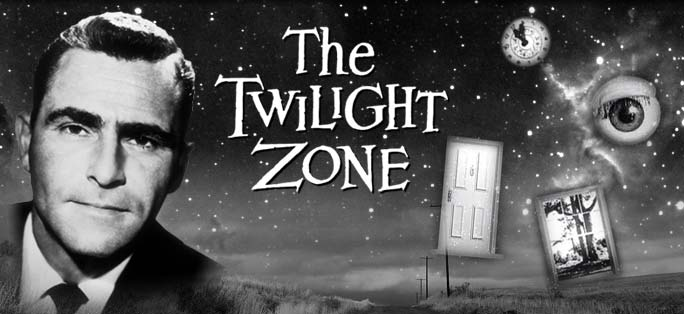

> You unlock this door with the key of imagination. Beyond it is another dimension: a dimension of sound, a dimension of sight, a dimension of mind. You're moving into a land of both shadow and substance, of things and ideas; you've just crossed over into the Twilight Zone.

 

> The mesopelagic zone extends from 200 to 1,000 meters (660-3,300 feet) below the surface of the ocean. This area is known as the twilight zone

> There are a number of marine animals that live in the mesopelagic zone. These animals include fish, shrimp, squid, snipe eels, jellyfish, and zooplankton.

   

> Some have 4d git branches and one big D

