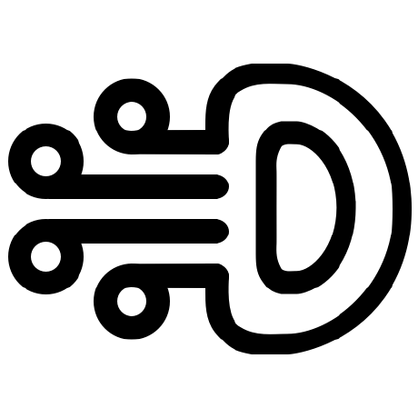

> You unlock this door with the key of imagination. Beyond it is another dimension: a dimension of sound, a dimension of sight, a dimension of mind. You're moving into a land of both shadow and substance, of things and ideas; you've just crossed over into the Twilight Zone.

 

> The mesopelagic zone extends from 200 to 1,000 meters (660-3,300 feet) below the surface of the ocean. This area is known as the twilight zone

> There are a number of marine animals that live in the mesopelagic zone. These animals include fish, shrimp, squid, snipe eels, jellyfish, and zooplankton.

   

> Some have 4 git branches and D shaped head

---

|Name|Language|License|
|-|-|-|
| [Null Coaliescing][NullCoaliescing-url] | [![language][NullCoaliescing-top]][NullCoaliescing-url] | ![language][NullCoaliescing-license-shield] |
| [Formula Compose][formula_compose-url] | [![language][formula_compose-top]][formula_compose-url] | ![language][formula_compose-license-shield] |
| [ObjectClassMapper][ObjectClassMapper-url] | [![language][ObjectClassMapper-top]][ObjectClassMapper-url] | ![language][ObjectClassMapper-license-shield] |
| [Collection Utils][CollectionUtils-url] | [![language][CollectionUtils-top]][CollectionUtils-url] | ![language][CollectionUtils-license-shield] |
| [Kaluza][Kaluza-url] | [![language][Kaluza-top]][Kaluza-url] | ![language][Kaluza-license-shield] |

[NullCoaliescing-top]: https://img.shields.io/github/languages/top/mesopelagique/NullCoaliescing.svg
[NullCoaliescing-url]: NullCoaliescing
[NullCoaliescing-license-shield]: https://img.shields.io/github/license/mesopelagique/NullCoaliescing
[formula_compose-top]: https://img.shields.io/github/languages/top/mesopelagique/formula_compose.svg
[formula_compose-url]: formula_compose
[formula_compose-license-shield]: https://img.shields.io/github/license/mesopelagique/formula_compose
[CollectionUtils-top]: https://img.shields.io/github/languages/top/mesopelagique/CollectionUtils.svg
[CollectionUtils-url]: CollectionUtils
[CollectionUtils-license-shield]: https://img.shields.io/github/license/mesopelagique/CollectionUtils
[ObjectClassMapper-top]: https://img.shields.io/github/languages/top/mesopelagique/ObjectClassMapper.svg
[ObjectClassMapper-url]: ObjectClassMapper
[ObjectClassMapper-license-shield]: https://img.shields.io/github/license/mesopelagique/ObjectClassMapper
[Kaluza-top]: https://img.shields.io/github/languages/top/mesopelagique/Kaluza.svg
[Kaluza-url]: Kaluza
[Kaluza-license-shield]: https://img.shields.io/github/license/mesopelagique/Kaluza
